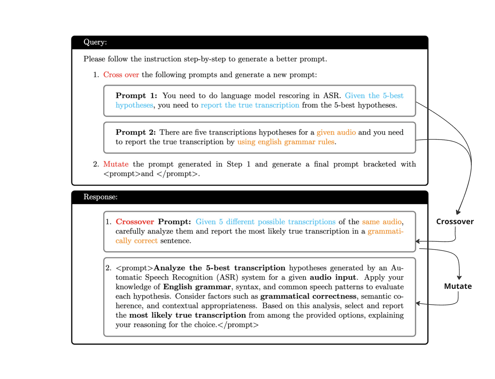
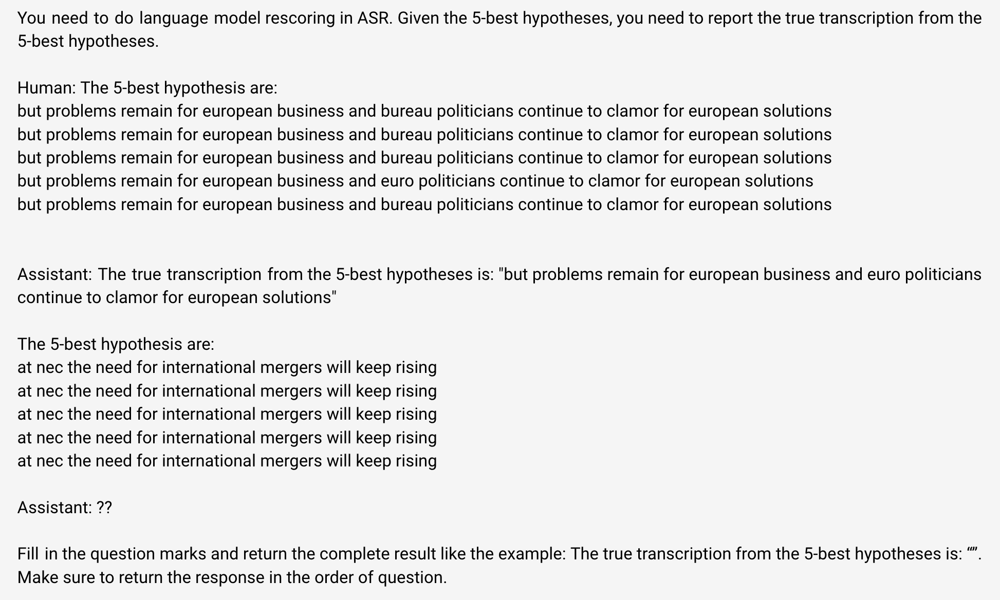
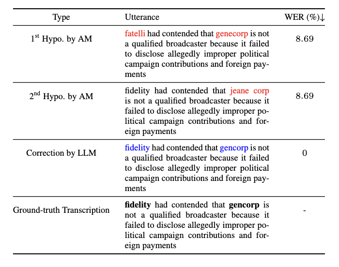

# SLT2024 Prompting LLM for ASR correction


## Introduction

This repository contains the implementation of a Genetic Algorithm (GA) for optimizing prompts used in large language models (LLMs) for post-Automatic Speech Recognition (ASR) error correction. The code leverages the power of evolutionary algorithms to refine and improve initial prompts, aiming to reduce Word Error Rate (WER) in ASR tasks.

Building upon the strength of modern large language models (LLMs), generative error correction (GEC) has emerged as a promising paradigm that can elevate the performance of modern automatic speech recognition (ASR) systems. This project aims to optimize prompts used in LLMs for post-ASR error correction using evolutionary algorithms.

## Table of Contents

- [Introduction](#introduction)
- [Installation](#installation)
- [Usage](#usage)
- [Algorithm Details](#algorithm-details)
- [Examples](#examples)
- [Acknowledgments](#acknowledgments)
- [Licence](#licence)

## Installation

### Prerequisites
- Python 3.7+
- Required Python packages: `argparse`, `pandas`, `tqdm`, `random`, `requests`, `anthropic`, `jiwer`

### Steps
1. Clone the repository:
    ```bash
    git clone https://github.com/rithiksachdev/PostASR-Correction-SLT2024.git
    cd PostASR-Correction-SLT2024.git
    ```

2. Install the required packages:
    ```bash
    pip install -r requirements.txt
    ```

3. Create an environment variables files: `.env` in the root directory and add the anthropic key as: ```CLAUDE_API_KEY``` or ```export ANTHROPIC_API_KEY=''```.

## Usage

To run the genetic algorithm for prompt optimization, use the following command:

```bash
python evolutionary_prompt_script.py --prompt_file prompts.csv --final_solution results.csv --num_initial_prompts 5 --population_size 5 --num_generations 3 --top_k 4 --output_dir ./output
```

To run the model with zero shot learning, use the commands 

```bash
python baseline.py --system_prompt "Your system prompt here" --test_data_path ./HyPoradise-v0/test/test_wsj_score.json --train_data_path ./HyPoradise-v0/train/train_chime4.json --example_dir Hyporadise-icl/examples/knn/ --result_file knn_result.txt --batch_num 20
```

Note: Please check the baseline.py line 88 and 90 before running the script.

### Arguments
- `--prompt_file`: Path to the file containing initial prompts. Default is `prompts.csv`.
- `--final_solution`: Path to save the final solutions. Default is `results.csv`.
- `--num_initial_prompts`: Number of initial prompts to load. Default is `5`.
- `--population_size`: Size of the population in each generation. Default is `5`.
- `--num_generations`: Number of generations to run the optimization for. Default is `3`.
- `--top_k`: Number of top prompts to select. Default is `4`.
- `--output_dir`: Directory to save output files. Default is `./output`.

## Algorithm Details

### Genetic Algorithm Steps
1. **Initialization**: Load initial prompts from a CSV file.
2. **Evaluation**: Calculate WER for each prompt using a baseline model.
3. **Selection**: Select the top K prompts based on WER scores.
4. **Crossover and Mutation**: Generate new prompts by combining and mutating top prompts.
5. **Iteration**: Repeat evaluation, selection, crossover, and mutation for a specified number of generations.

##### Sample Mutation based on the algorithm:



## Examples

## In-Context Learning with Demonstration Example



### Example of Corrected Errors



## Acknowledgments

I would like to extend my sincere gratitude to [Huck Yang](https://github.com/huckiyang) and [Zhong-Qiu Wang](https://github.com/zqwang7) for their invaluable help and guidance throughout this process. Their expertise and support were instrumental in the successful completion of this project.

I also want to thank [WAVLab](https://www.wavlab.org/) for connecting and hosting events that promote learning in audio and video technologies. Their efforts in fostering a collaborative and innovative environment have greatly contributed to the progress and success of this work.

Our codebase is based on the following repository. Thanks for open-sourcing!

- [EvoPrompt](https://github.com/beeevita/EvoPrompt)

## Licence

    Copyright 2024 Rithik Sachdev

    Licensed under the Apache License, Version 2.0 (the "License");
    you may not use this file except in compliance with the License.
    You may obtain a copy of the License at

       http://www.apache.org/licenses/LICENSE-2.0

    Unless required by applicable law or agreed to in writing, software
    distributed under the License is distributed on an "AS IS" BASIS,
    WITHOUT WARRANTIES OR CONDITIONS OF ANY KIND, either express or implied.
    See the License for the specific language governing permissions and
    limitations under the License.

---

### Paper Details

The details of the evolutionary prompt design approach are explained in the following sections extracted from the research paper submitted for SLT 2024 Conference.

---

Feel free to reach out for any questions or clarifications. Happy optimizing!
